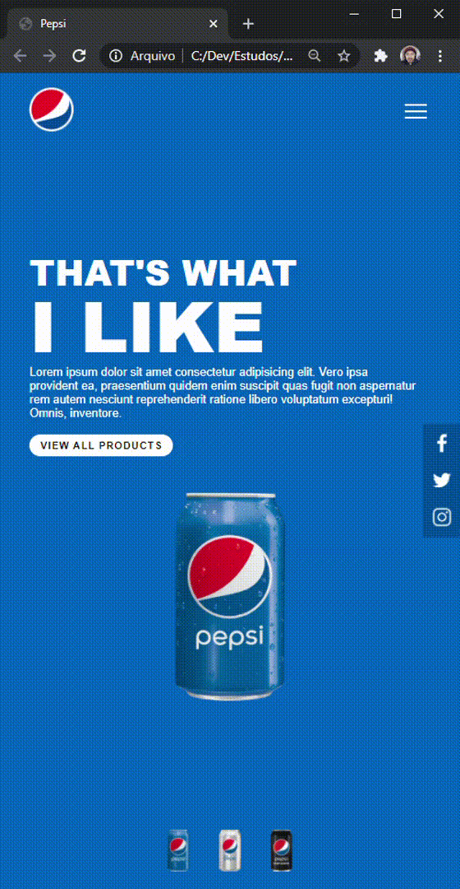

<h1 align="center">
    
</h1>

  <a href="#-tecnologias">Tecnologias</a>&nbsp;&nbsp;&nbsp;|&nbsp;&nbsp;&nbsp;
    <a href="#-demo">DEMO</a>&nbsp;&nbsp;&nbsp;

 

## Pepsi UI Clone
 
Neste trabalho foi abordado temas como responsividade, manipulação da DOM e flexbox.
 
 

  

## 🚀 Tecnologias

Esse projeto foi desenvolvido com as seguintes tecnologias:

- [HTML5](https://developer.mozilla.org/pt-BR/docs/Web/HTML/HTML5)
- [CSS3](https://developer.mozilla.org/pt-BR/docs/Web/CSS)
- [FlexBox](https://developer.mozilla.org/pt-BR/docs/Web/CSS/CSS_Flexible_Box_Layout/Conceitos_Basicos_do_Flexbox)
- [Javascript](https://developer.mozilla.org/pt-BR/docs/Web/JavaScript)

## 🔖 DEMO

 

  

  

  

Desenvolvido com 💜 por Bruno Pedroso

